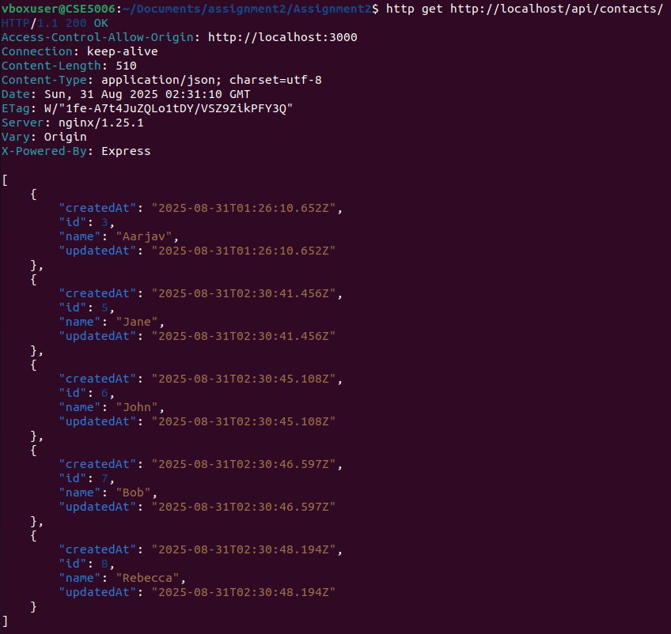
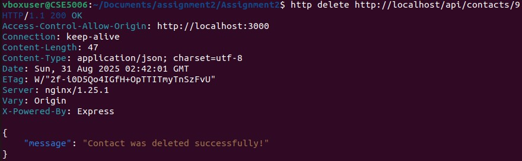
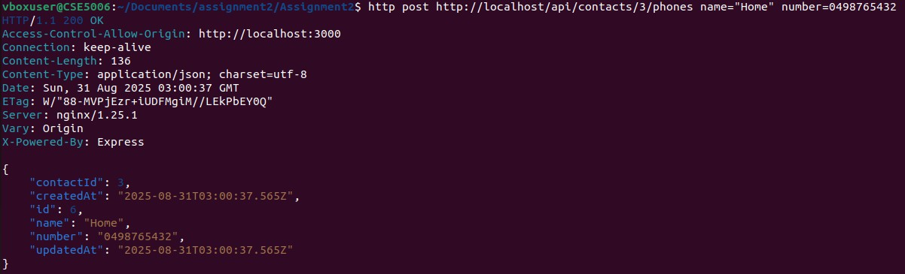
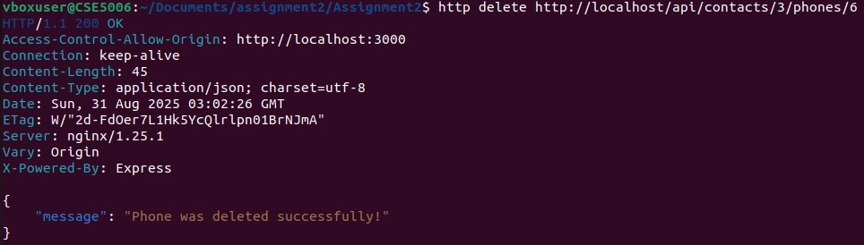

# Task 2
## Task 2.1
http GET http://localhost/api/contacts/

## Task 2.2
http post http://localhost/api/contacts/ name="Jeremy"

## Task 2.3
http delete http://localhost/api/contacts/9

## Task 2.4
http put http://localhost/api/contacts/6 name="Jon"

## Task 2.5
http get http://localhost/api/contacts/3/phones

## Task 2.6
http post http://localhost/api/contacts/3/phones name="Home" number=0498765432

## Task 2.7
http delete http://localhost/api/contacts/3/phones/6

## Task 2.8
http put http://localhost/api/contacts/3/phones/5

