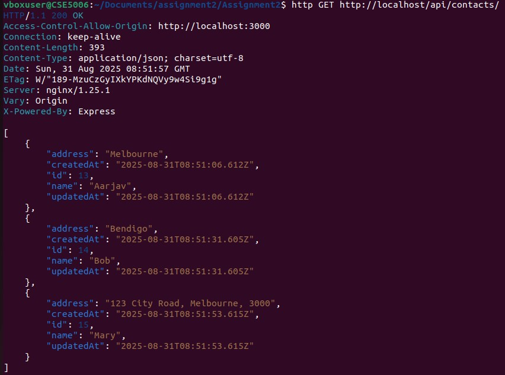
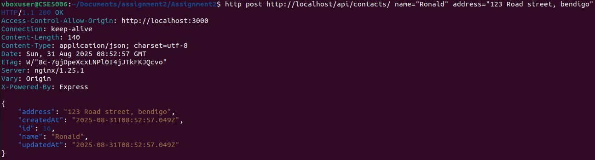
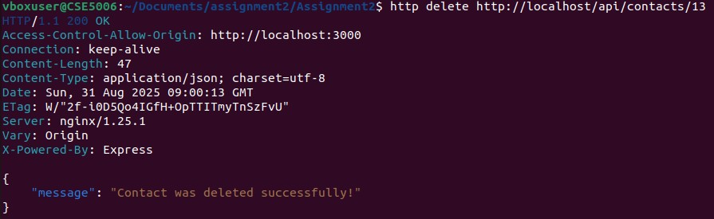
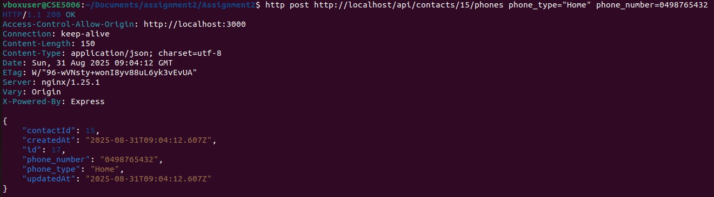
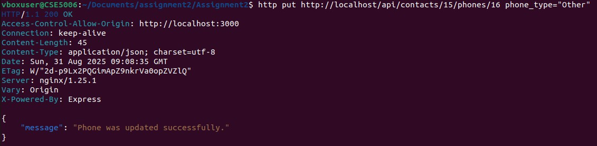

# Task 3
## Task 3.1
http GET localhost/api/contacts/

## Task 3.2
http post http://localhost/api/contacts/ name="Ronald" address="123 Road street, bendigo"

## Task 3.3
http delete http://localhost/api/contacts/13

## Task 3.4
http put http://localhost/api/contacts/16 name="Ron"

## Task 3.5
http get http://localhost/api/contacts/3/phones

## Task 3.6
http post http://localhost/api/contacts/15/phones phone_type="Home" phone_number=0498765432

## Task 3.7
http delete http://localhost/api/contacts/15/phones/17

## Task 3.8
http put http://localhost/api/contacts/15/phones/

